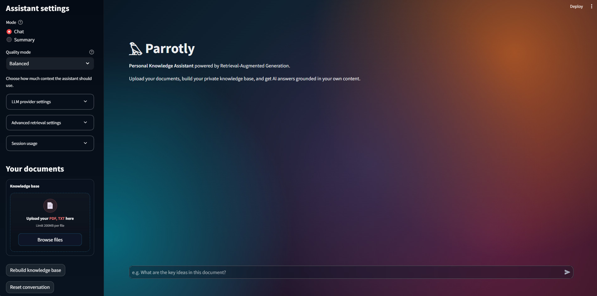
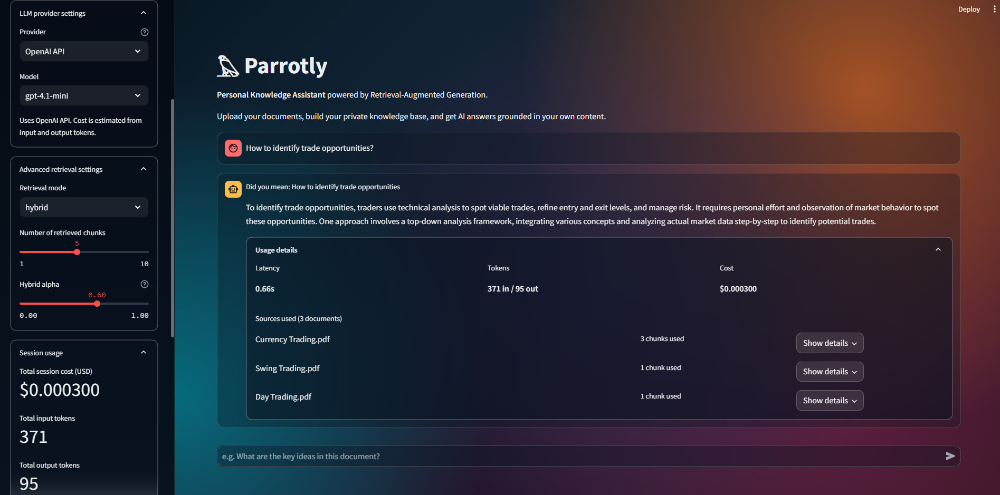

# 𓅃 Parrotly

**Personal Knowledge Assistant powered by Retrieval-Augmented Generation (RAG).**

Parrotly is a modular AI application that allows users to build a private knowledge base from their own documents and interact with it using natural language.

The project focuses on transparent and experiment-driven RAG development:
document processing, hybrid retrieval, reranking, local/cloud LLM support and retrieval evaluation.

---

## Overview

Parrotly allows users to:

- Upload PDF and TXT documents
- Build a searchable private knowledge base
- Ask questions grounded in document context
- Generate document summaries
- Inspect retrieved sources used for answers
- Compare different retrieval strategies
- Monitor token usage, latency and estimated costs
- Switch between local and cloud-based LLM providers

---

## Demo

### Main application view



### Usage details



---

# Key Features

## Document Processing

- PDF and TXT ingestion
- LangChain document loaders
- Recursive text splitting
- Metadata preservation
- OCR fallback for scanned PDFs

---

## Hybrid Retrieval

The retrieval system combines multiple search strategies:

### Dense retrieval
- FAISS vector search
- Semantic similarity using embeddings

### Sparse retrieval
- TF-IDF keyword-based retrieval

### Hybrid search
- Weighted score fusion
- Adjustable retrieval parameters

---

## Reranking

Additional post-retrieval ranking layer:

- Combines semantic relevance and keyword overlap
- Improves ordering of retrieved chunks
- Filters final context passed to the LLM

---

## Generation

Supports multiple LLM providers:

### Cloud
- OpenAI models
- Token and cost tracking

### Local
- Ollama integration
- Open-source models support

Generated responses are based on retrieved document context.

---

## Evaluation Framework

Parrotly includes a dedicated retrieval evaluation pipeline.

Supported metrics:

- Top-K accuracy
- Hit Rate
- Mean Reciprocal Rank (MRR)
- Recall@K
- Retrieval latency

The evaluation framework is used to compare different retrieval configurations:

- Dense retrieval
- Sparse retrieval
- Hybrid retrieval
- Different Top-K values
- Different fusion weights

Example results:

| Mode   | Top-1 | Top-3 | Top-5 | MRR  | Recall@5 |
|--------|------|------|------|------|----------|
| Dense  | 0.90 | 0.90 | 1.00 | 0.92 | 1.00 |
| Sparse | 0.80 | 0.90 | 1.00 | 0.85 | 1.00 |
| Hybrid | 0.90 | 1.00 | 1.00 | 0.95 | 1.00 |

Hybrid retrieval achieved the best ranking quality in the current evaluation dataset.

---

# Architecture

```text
Documents
    |
    v
Document Processing
(LangChain loaders + splitting + OCR)
    |
    v
Embedding Generation
    |
    v
Knowledge Index
(FAISS + TF-IDF)
    |
    v
Query Processing
(normalization + correction)
    |
    v
Hybrid Retrieval
    |
    v
Reranking
    |
    v
Context Builder
    |
    v
LLM Generation
(OpenAI / Ollama)
    |
    v
Answer + Sources + Metrics
```

---

# Project Structure

```text
rag/

├── indexing/
│   ├── loaders
│   ├── chunking
│   └── embeddings
│
├── retrieval/
│   ├── dense retrieval
│   ├── sparse retrieval
│   └── hybrid search
│
├── pre_retrieval/
│   └── query processing
│
├── post_retrieval/
│   └── reranking
│
├── generation/
│   └── LLM providers
│
├── orchestration/
│   └── RAG pipeline

evaluation/

├── test_cases.py
└── evaluate.py

app.py
```

---

# Running Locally

## 1. Install dependencies

```bash
pip install -r requirements.txt
```

---

## 2. Configure environment

Create `.env`:

```env
OPENAI_API_KEY=your_key_here

LLM_PROVIDER=openai
```

For local models:

```env
LLM_PROVIDER=ollama

OLLAMA_BASE_URL=http://localhost:11434
```

---

## 3. Optional: install Ollama models

```bash
ollama pull llama3.1:8b

ollama pull nomic-embed-text
```

---

## 4. Build knowledge base

```bash
python -m rag.indexing.builder
```

---

## 5. Start application

```bash
streamlit run app.py
```

---

# Run Evaluation

```bash
python -m evaluation.evaluate
```

This runs retrieval experiments and compares available retrieval configurations.

---

# Technology Stack

- Python
- LangChain
- FAISS
- Scikit-learn
- OpenAI API
- Ollama
- Streamlit
- Pydantic
- NumPy / Pandas

---

# Future Improvements

- Persistent conversation history
- Additional vector databases comparison
- RAGAS / LLM-based answer evaluation
- More advanced query transformations
- Containerized deployment

---

# Author

Bartłomiej Jamiołkowski
